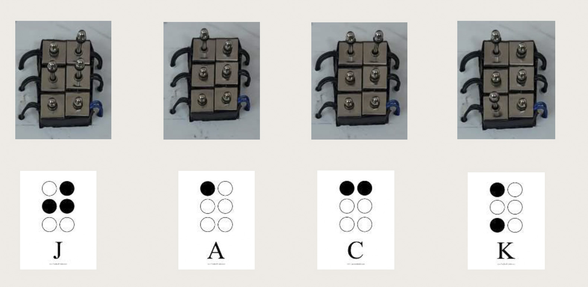
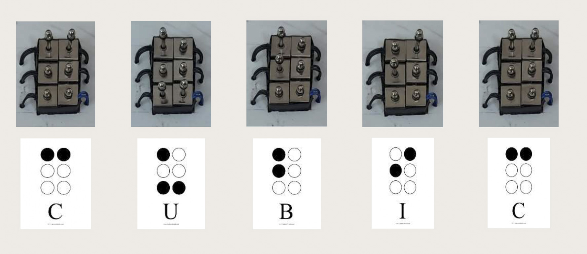

# Arduino-Braille-Display-for-Visually-Impaired

A low-cost refreshable Braille display that converts text stored in an SD card into tactile Braille characters using six push-pull solenoids controlled by an Arduino Uno. The system provides an affordable learning platform for visually impaired users.

## ✨ Key Features

- 📖 Reads text directly from an SD card.
- ⠿ Converts English characters into 6-dot Braille patterns.
- ⚡ Controls six push-pull solenoids using relay modules.
- 🔄 Generates a refreshable single-cell Braille display.
- 💾 Uses SPI communication for SD card interfacing.
- 🔌 Designed using low-cost and easily available hardware components.
- 🛠️ Easy to modify, extend, and customize for future enhancements.

## Hardware Components

### Arduino UNO
The main controller that executes the Braille translation algorithm.

### SD Card Module
Reads text files stored on the SD card using SPI communication.

### Relay Modules
Switch the 12V power required for the solenoids.

### Push-Pull Solenoids
Produce tactile Braille dots by mechanical movement.

### LM2596 Buck Converter
Provides a regulated 5V power supply.

### Power Supply
12V DC adapter for driving the solenoids.

### Breadboard & Jumper Wires
Used for circuit prototyping and interconnections.


## 💻 Software Used

- Arduino IDE
- SPI Library
- SD Library

## 🔌 Circuit Diagram

<p align="center">
  
</p>

The circuit consists of an Arduino UNO connected to an SD card module using SPI communication. Two 4-channel relay modules interface the Arduino with six push-pull solenoids. An LM2596 buck converter provides a regulated 5V supply, while a 12V adapter powers the solenoids.


## ⚙️ Working Principle

The project operates in the following sequence:

1. The user stores a text file on the SD card.
2. The Arduino reads one character at a time using the SD library.
3. Each character is translated into its corresponding 6-dot Braille pattern.
4. The Arduino energizes the appropriate relay channels.
5. The relays switch the 12V supply to the required solenoids.
6. The activated solenoids raise the Braille dots.
7. The displayed Braille character is refreshed for the next character in the text.

## 📁 Repository Structure

```text
Arduino-Refreshable-Braille-Display/
│
├── firmware/        # Arduino source code
├── hardware/        # Circuit diagrams and hardware files
├── docs/            # Project report and presentation
├── images/          # Project images and diagrams
├── libraries/       # Libraries used
├── videos/          # Demo video links
└── README.md        # Project documentation
```

## ▶️ How to Run

1. Clone this repository.

   ```bash
   git clone https://github.com/tarunchagantipati/Arduino-Braille-Display-for-Visually-Impaired.git
   ```

2. Open the firmware located in the `firmware/` folder using Arduino IDE.

3. Install the required Arduino libraries:
   - SPI
   - SD

4. Copy any text file of your own to the SD card.

5. Connect the hardware according to the circuit diagram.

6. Upload the firmware to the Arduino UNO.

7. Power the circuit using the recommended power supply.

8. The Arduino reads the text file and displays each character as a refreshable Braille cell.


## 📸 Results

The developed prototype successfully converts text stored on an SD card into refreshable Braille characters using six push-pull solenoids.


### Output Demonstration

<p align="center">
  
  
</p>

## 🚀 Future Improvements

The project can be enhanced in several ways:

- Support for multiple refreshable Braille cells to display complete words.
- Bluetooth or Wi-Fi connectivity for wireless text transfer.
- Integration with OCR systems for printed document reading.
- Text-to-Speech support for multimodal accessibility.
- Mobile application for remote control and text transmission.
- Reduced hardware size using custom PCB design.
- Replacement of relay modules with MOSFET drivers for faster and quieter operation.

